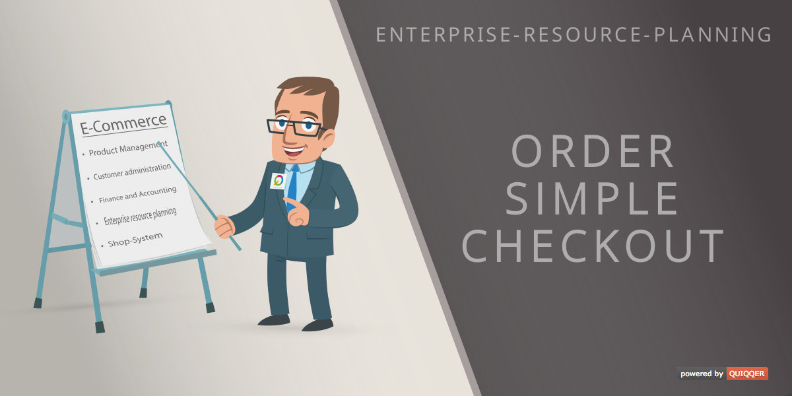

# Order Simple Checkout

The QUIQQER Simple Checkout plugin is a seamless extension for your QUIQQER system that simplifies and speeds up the
checkout process. With this plugin, your customers can complete their purchase on a single page, eliminating multi-step
processes. It is ideal for services or online stores that offer a small selection of products or items with low
complexity. The simple checkout provides a clear and straightforward user experience, allowing visitors to complete
their transactions quickly and easily. Benefit from a more efficient checkout that increases customer satisfaction and
makes it easier to complete purchases.

Package Name:

    quiqqer/order-simple-checkout

Features
--------

* New site type
    * Fast and simple checkout

Installation
------------
The Package Name is: quiqqer/order-simple-checkout

Contribute
----------

- Project: https://dev.quiqqer.com/quiqqer/order-simple-checkout
- Issue Tracker: https://dev.quiqqer.com/quiqqer/order-simple-checkout/issues
- Source Code: https://dev.quiqqer.com/quiqqer/order-simple-checkout/tree/master

Support
-------
If you found any errors or have wishes or suggestions for improvement,
please contact us by email at support@pcsg.de.

We will transfer your message to the responsible developers.

License
-------

- GPL-3.0+
- PCSG QEL-1.0
